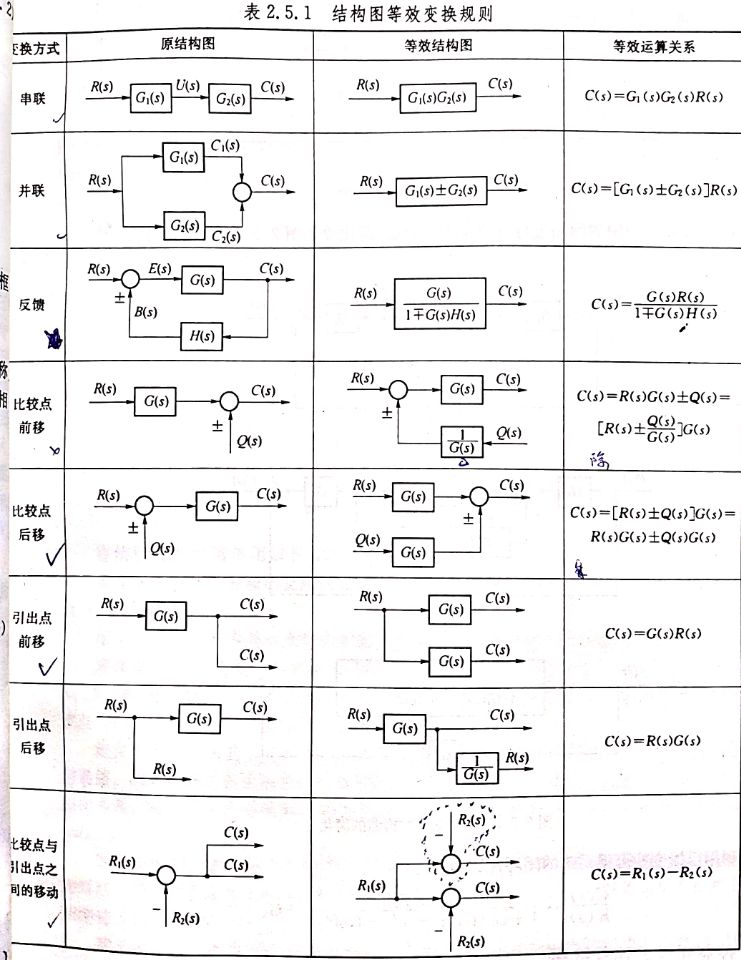
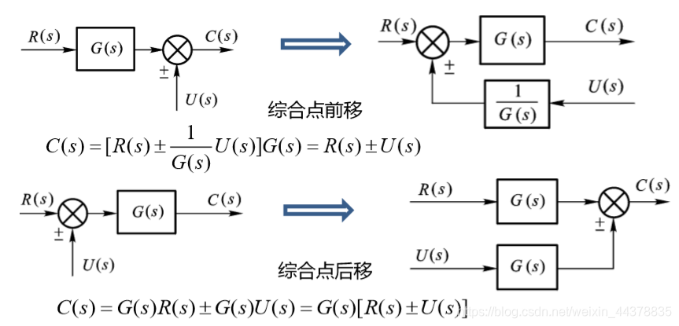
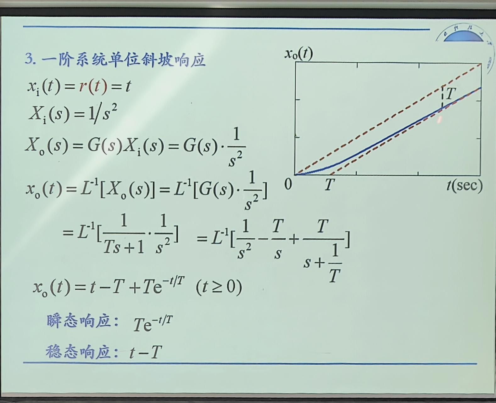
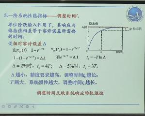
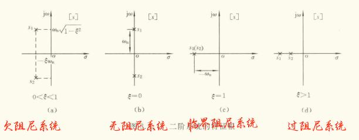
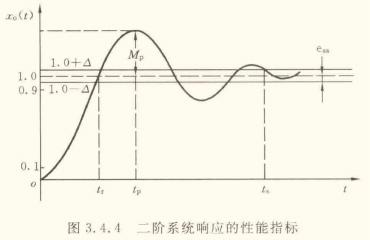
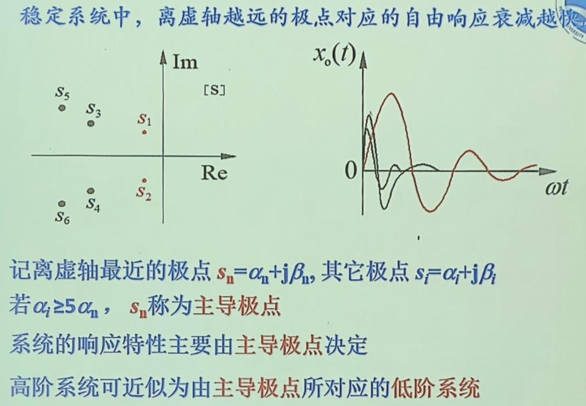
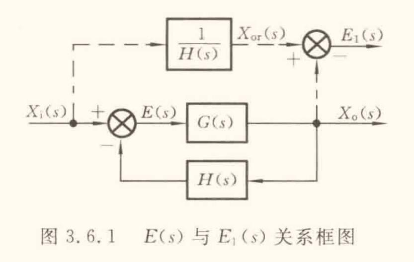
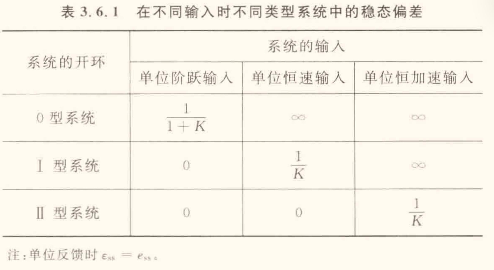

### 1. 绪论

### 2. 系统的数学模型
#### 系统的微分方程
- 高阶微/积分的拉普拉斯变换
$$
\begin{aligned}
\mathcal{L} \left[ \frac{d^nx(t)}{dt^n} \right] = X(s)S^n  \\
\mathcal{L} \left[ \int \overset{n}{\cdots} \int x(t)(dt)^n \right] = \frac{X(s)}{S^n} 
\end{aligned}
$$
#### 系统的传递函数
- 特点
    - 传递函数是关于复变量 s 的复变函数，为 **复域数学模型**
    - 分母反映系统本身的固有特性，与外界无关；分子反映系统与外界的联系
    - 在零初始条件下，输入确定时，输出完全取决于传递函数 $\mathrm{x_{o}}(t) = \mathcal{L}^{-1} [X_{o}(s)] = \mathcal{L}^{-1}[G(s)X_{i}(s)]$ 
    - 物理性质不同的系统，可以具有相同的传递函数（相似系统）

$$
G(s) = \frac{X_{o}(s)}{X_{i}(s)} = \frac{b_{m}s^m + b_{m-1}s^{m-1} + \cdots + b_{1}s + b_{0}}{a_{n}s^n + a_{n-1}s^{n-1} + \cdots + a_{1}s + a_{0}}, \quad n \geq m
$$
- 系统稳定的 **充要条件** ：极点有负实部
    - 分子 **零点** ；分母 **极点** $\rightarrow$ **零极点模型**
- 典型环节
    $$
    G(s) = \frac{\displaystyle{K\prod_{i = 1}^b( \tau_{i}s+1) \prod_{l = 1}^c (\tau _{l}^2s^2 + 2 \xi_{l}\tau_{l}s + 1)}}{\displaystyle s^v\prod_{j = 1}^d(T_js+1)\prod_{k = 1}^e (T _{k}^2s^2 + 2 \xi_{k}T_{k}s + 1)} 
    $$ 
    $$
    G(s) = 
    \frac{
      \displaystyle
      \overbrace{K}^{\text{比例}}
      \overbrace{\prod_{i = 1}^b (\tau_{i}s + 1)}^{\text{一阶微分环节}}
      \overbrace{\prod_{l = 1}^c (\tau_{l}^2 s^2 + 2 \xi_{l}\tau_{l}s + 1)}^{\text{二阶振荡（微分型）}}
    }{
      \displaystyle
      \underbrace{s^v}_{\text{积分环节（$v$ 阶）}}
      \underbrace{\prod_{j = 1}^d (T_j s + 1)}_{\text{惯性环节}}
      \underbrace{\prod_{k = 1}^e (T_{k}^2 s^2 + 2 \xi_{k} T_{k} s + 1)}_{\text{二阶振荡（惯性型）}}
    }
    $$
    - 比例环节
        - $G(s) = \frac{X_o(s)}{X_i(s)} = K$
    - 惯性环节
        - $G(s) = \frac{1}{Ts + 1}$
        - 惯性环节一般包含一个储能元件和一个耗能元件
    - 微分环节
        - $G(s) = \frac{X_o(s)}{X_{i}(s)} = Ts$
        - **微分环节不可能单独存在**
    - 积分环节
        -  $G(s) = \frac{X_o(s)}{X_{i}(s)} = \frac{1}{Ts}$
    - 振荡环节（二阶振荡环节）  #复习/重点 
        - $G(s) = \frac{\omega _{n}^2}{s^2+2\xi \omega _{n}s + \omega _{n}^2}$ 或写成 $G(s) = \frac{1}{T ^{2}s ^{2} + 2 \xi Ts + 1}$ 
        - $\omega _{n}$ 为无阻尼固有频率；$T$ 为振荡环节的时间常数，$T = \frac{1}{\omega _{n}}$；$\xi$ 为阻尼比，$0 \leq \xi \lt 1$ .  
#### 方框图及其简化
   - 串联
        - $G(s) = G_{1}(s) G_{2}(s)$ 
    - 并联
        - $G_{s} = G_{1}(s) \pm G_{2}(s)$ 
    - 开环传递函数
        - $G_{K} = \frac{B(s)}{E(s)} = G(s)H(s)$ 
        - **开环传递函数无量纲** 
    - 闭环传递函数
        - $G_{B}(s) = \frac{X_{o}(s)}{X_{i}(s)} = \frac{\prod \text{前向通路传递函数}}{1+ \sum{\text{每一反馈回路开环传递函数}}}$ %% 例 ：P57%% 

 

### 3. 时域响应分析
#### 典型输入信号 
%% 教材P86 %%
- 单位脉冲信号(功率密度信号)
- 单位阶跃信号(位置信号)
- 单位斜坡信号(速度信号)
- 单位加速度信号
- 正/余弦信号
- 随机信号

图中 $R_{s}$ 即 $X_i(s)$
#### 一阶系统 
%%P86%%
##### 单位脉冲响应
- 初值定理：$$f(0^+) = \lim_{t \to 0} f(t) = \lim_{s \to \infty} s F(s)$$ 
- **终值定理**：$$\lim_{t \to \infty} f(t) = \lim_{s \to 0} s F(s)$$
- 当系统的输入信号 $x_i(t)$ 是理想单位脉冲函数 $\delta(t)$ 时，系统的输出 $x_o(t)$ 称为单位脉冲响应，特别记为 $\omega(t)$。
$$
\begin{aligned}
\omega(t) &= \mathcal{L}^{-1}[G(s)] = \mathcal{L}^{-1}\left[ \frac{1}{Ts+1}\right] \\
\omega(t) &= \frac{1}{T} \mathrm{e}^{-\frac{t}{T}} \qquad (t \geq 0)
\end{aligned}
$$
##### 单位阶跃响应
- $$
\begin{aligned}
x_{ou}(t) &= \mathcal{L}^{-1}[X_o(s)] = 1- \mathrm{e}^{-\frac{t}{T}} \qquad (t \geq 0)
\end{aligned}
$$
##### 单位斜坡响应

$$
\begin{aligned}
x_{i}(t) &= r(t) = t\\
X_{i}(s) &= \frac{1}{s^2}\\
X_{o}(s) &= G(s)X_{i}(s) = G(s) \cdot \frac{1}{s^2}\\
x_{o}(t) &= \mathcal{L}^{-1} [G(s) \cdot \frac{1}{s^2}]\\
&=\mathcal{L}^{-1} \left[  \frac{1}{Ts+1} \cdot \frac{1}{s^2} \right] = \mathcal{L}^{-1}\left[ \frac{1}{s^2}-\frac{T}{s}+\frac{T}{s+\frac{1}{T}} \right]\\
x_{o}(t) &= t-T+T\mathrm{e}^{-t/T} \quad (t \geq 0)\\
\end{aligned}
$$

$\text{瞬态响应：}T\mathrm{e}^{-t/T}$
$\text{稳态响应：}t-T$

##### 一阶系统性能指标

- 调整时间 $t_{s}$：反映系统响应的快速性
- 相对容许误差 $\Delta$ 

#### 二阶系统

- 传递函数：$G(s) = \frac{X_{o}(s)}{X_{i}(s)} = \frac{\omega_{n}^2}{s^2+2\xi \omega_{n}s+\omega_{n^2}}$
- 特征方程：${s^2+2\xi \omega_{n}s+\omega_{n^2}} = 0$ 
- 特征根：$s_{1,2} = -\xi \omega_{n} \pm \omega_{n}\sqrt{ \xi^2-1 }$ 
    - $0<\xi<1$ 时，两特征根为 **共轭复数**，即 $s_{1,2} = -\xi \omega_{n} \pm \mathrm{j}\omega_{n}\sqrt{ 1-\xi^2 }$ 
        - $\omega_{d} = \omega_{n}\sqrt{ 1-\xi^2 }$ 称为有阻尼固有频率，此时系统 **欠阻尼** 
    - $\xi =0$ 时，共轭 **纯虚根**，即 $s_{1,2} = \pm \mathrm{j}\omega_{n}$，此时系统称为 **无阻尼系统** 
    - $\xi = 1$ 时，有两个 **相等负实根**，即 $s_{1,2} = -\omega_{n}$，此时称为 **临界阻尼系统**
    - $\xi>1$时，有两个 **不等的负实根**，即 $s_{1,2} = -\xi \omega_{n} \pm \omega_{n}\sqrt{ \xi^2-1 }$，此时称为 **过阻尼系统** 
    - 
 
##### 单位脉冲响应

##### 单位阶跃响应

##### 性能指标

- $\beta = \mathrm{\arctan{\sqrt{ \frac{1-\xi^2}{\xi} }}}$ 
- 上升时间$t_r = \frac{ \pi-\beta}{\omega_{d}} = \frac{{\pi-\beta}}{\omega_{n}\sqrt{ 1-\xi^2 }}$ 
    - $\xi - ,\omega_{n} \uparrow,t_{r}\downarrow;\omega_{n}-,\xi\uparrow,t_{r}\uparrow$
- 峰值时间$t_p = \frac{\pi}{\omega_{d}} = \frac{{\pi}}{\omega_{n}\sqrt{ 1-\xi^2 }}$ 
    - $\xi - ,\omega_{n} \uparrow,t_{p}\downarrow;\omega_{n}-,\xi\uparrow,t_{p}\uparrow$
- 最大超调量$M_p$
- 调整时间$t_s$
- 振荡次数 $N$ 
- $T_{s}=\frac{4}{\xi\omega_{n}}(\delta=\pm5\%)$
- $T_{s}=\frac{3}{\xi\omega_{n}}(\delta=\pm5\%)$
- $PO=e^{\frac{\xi s}{\sqrt{1-\zeta^{2}}}}\times100\%$ %% fig/4 %%  
- 主导极点

#### 系统误差分析与计算

##### 系统的误差与偏差

- 一般情况下，系统的误差与偏差的关系：$$
    E(s) = H(s)E_{1}(s)\quad \text{或} \quad E_{1}(s) = \frac{1}{H(s)}E(s)$$
    
    
    
    - 对于单位反馈系统，$H(s) = 1$，故偏差 $\varepsilon(t)$ 与误差 $e(t)$ 相同。

##### 与输入有关的稳态偏差

- 设系统的开环传递函数 $$G_{\mathrm{K}}(s) = G(S)H(s) = \dfrac{K\prod_{i = 1}^m(T_{i}s+1)}{s^{\nu}\prod_{j = 1}^{n-\nu}(T_{j}s+1)}$$
- 记 $$G_{o(s)} = \dfrac{\prod_{i = 1}^m(T_{i}s+1)}{\prod_{j = 1}^{n-\nu}(T_{j}s+1)}$$则可将系统开环传递函数表示为$$G_{\mathrm{K}}(s) = G(S)H(s) = \dfrac{KG_{o}(s)}{s^{\nu}}$$
- $\nu$ 为串联积分环节的个数，或称 **系统无差度**，表现系统的结构特性。
- **系统型别**：工程上一般规定：$\nu = 0,1,2,\cdots$ 时，系统分别称为 0 型、I 型和 II 型系统…… $\nu$ 越大，稳态精度越高，但稳定性越差，因此，一般不超过 III 型。
- 输入为单位阶跃信号 $X_{i}(s) = \frac{1}{s}$ 时，**位置无偏系数** $K_{p}$ %% P105-P107 %%
- 输入为单位斜坡信号 $X_{i}(s) = \frac{1}{s^2}$ 时，**速度无偏系数** $K_{v}$
- 输入为加速度信号 $X_{i}(s) = \frac{1}{s^3}$ 时，**加速度无偏系数** $K_{a}$ 
- 

### 4. 频域响应分析

### 5. 系统稳定性分析

### 6. 性能指标