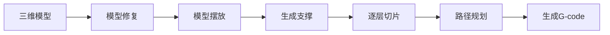
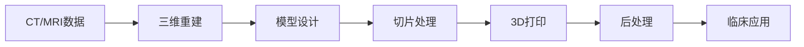
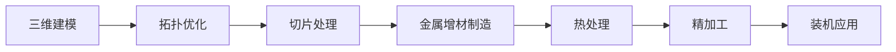

---
author:
  - T!gger.
  - ChatGPT
project: 复习
created: 2026-06-27
tags:
  - 复习
---
# 增材制造装备

> 本文档由 ChatGPT 生成，数据真实性仅供参考。  
> 请自行进行交叉验证。

## 复习要点

SLA、SLS、SLM、** [[增材制造装备#FDM|FDM]] **、 ** [[增材制造装备#LOM|LOM]] **、 ** [[增材制造装备#LCF|LCF]] **、 EBM、** [[增材制造装备#3DP|3DP]] **等打印工艺原理、特点、参数等

几大部件的工作原理(** [[增材制造装备#支撑部件|支撑部件]] **、[[增材制造装备#打印头|打印头]]、** [[增材制造装备#激光振镜扫描系统|激光振镜扫描]] **、[[增材制造装备#运动控制部件|运动控制部件]]、** [[增材制造装备#打印文件类型与切片分层算法|打印文件类型与切片分层算法]] **、[[增材制造装备#预热控制部件|预热控制部件]]等）

[[增材制造装备#支撑|3D打印哪些工艺需要支撑、支撑种类、支撑材料有哪些]]

[[增材制造装备#生物组织结构打印|生物组织结构打印过程工艺步骤及特点（优缺点）]]

[[增材制造装备#3D 打印的几种应用类型及其原理|3D打印的几种应用类型及其原理（生物组织打印、医学打印、食品、建筑等）]]

[[增材制造装备#例题|例题]]

## 打印工艺原理、特点、参数等

### SLA

（Stereolithography Apparatus，立体光固化）

#### 原理

- 利用紫外激光（UV Laser）逐点扫描液态光敏树脂表面
- 激光照射区域发生光聚合反应并固化形成一层
- 工作台下降（或上升）一个层厚，重新铺覆树脂，重复固化直至完成

#### 成形材料

- 光敏树脂（Photopolymer Resin）

#### 主要设备组成

- UV激光器
- 振镜扫描系统
- 树脂槽
- 升降平台
- 控制系统

#### 典型工艺参数

| 参数 | 范围 |
|------|------|
| 层厚 | 0.025～0.15 mm |
| 激光波长 | 355 nm 或 405 nm |
| 激光功率 | 数十～数百 mW |
| 成形精度 | ±0.05～0.15 mm |

#### 特点

优点：

- 精度最高
- 表面质量最好
- 可制造复杂精细结构
- 尺寸稳定性好

缺点：

- 材料种类较少
- 光敏树脂价格高
- 后处理（清洗+二次固化）复杂
- 制件耐热性、韧性一般

#### 典型应用

- 工业原型
- 医疗模型
- 珠宝
- 模具母模

### SLS

（Selective Laser Sintering，选择性激光烧结）

#### 原理

- 激光扫描粉末床
- 激光使粉末烧结（接近熔化）形成实体
- 工作台下降，铺粉机构重新铺粉，重复烧结

#### 成形材料

- 尼龙（PA）
- TPU
- PEEK
- 金属粉末（部分设备）
- 陶瓷粉末

#### 主要设备组成

- CO₂激光器或光纤激光器
- 铺粉系统
- 粉床
- 加热系统

#### 典型工艺参数

| 参数 | 范围 |
|------|------|
| 层厚 | 0.06～0.20 mm |
| 激光功率 | 30～200 W |
| 预热温度 | 接近材料熔点 |
| 成形精度 | ±0.2 mm 左右 |

#### 特点

优点：

- 无需支撑
- 可加工复杂结构
- 材料利用率高
- 力学性能较好

缺点：

- 表面较粗糙
- 精度略低于SLA
- 粉末成本高
- 成形速度一般

#### 典型应用

- 功能件
- 小批量生产
- 医疗植入物
- 航空零件

### SLM

（Selective Laser Melting，选择性激光熔化）

#### 原理

- 激光完全熔化金属粉末
- 熔池凝固后形成致密金属层
- 铺粉、熔化不断重复完成零件制造

#### 成形材料

- 不锈钢
- 钛合金
- 铝合金
- 镍基高温合金
- 模具钢

#### 主要设备组成

- 高功率光纤激光器
- 铺粉机构
- 惰性气氛系统（Ar/N₂）
- 金属粉床

#### 典型工艺参数

| 参数 | 范围 |
|------|------|
| 层厚 | 20～60 μm |
| 激光功率 | 200～1000 W |
| 氧含量 | <100 ppm |
| 致密度 | >99% |

#### 特点

优点：

- 金属完全致密
- 力学性能接近锻件
- 可制造复杂内流道
- 精度高

缺点：

- 设备昂贵
- 成形速度较慢
- 热应力较大
- 后处理要求高

#### 典型应用

- 航空航天
- 医疗植入物
- 模具
- 高端装备

### FDM

（Fused Deposition Modeling，熔融沉积成形）

#### 原理

- 热熔喷嘴将丝材加热熔化
- 按路径连续挤出材料
- 每层冷却固化后继续堆积形成零件

#### 成形材料

- PLA
- ABS
- PETG
- TPU
- PC
- 尼龙
- 碳纤维增强材料

#### 主要设备组成

- 挤出喷头
- 加热器
- 丝材送料机构
- 三轴运动平台

#### 典型工艺参数

| 参数 | 范围 |
|------|------|
| 层厚 | 0.05～0.40 mm |
| 喷嘴温度 | 180～300 ℃ |
| 喷嘴直径 | 0.2～0.8 mm |
| 打印速度 | 30～150 mm/s |

#### 特点

优点：

- 成本最低
- 操作简单
- 材料丰富
- 维护方便

缺点：

- 层纹明显
- 精度一般
- Z向强度较低
- 需要支撑

#### 典型应用

- 教学
- 快速原型
- DIY
- 工程样件

### LOM

（Laminated Object Manufacturing，分层实体制造）

#### 原理

- 将片材逐层铺设
- 热压或胶黏结合
- 激光或刀具切割轮廓
- 重复叠层完成零件

#### 成形材料

- 纸
- 塑料薄膜
- 金属箔
- 复合材料

#### 主要设备组成

- 送纸机构
- 热压辊
- 激光切割系统
- 工作平台

#### 典型工艺参数

| 参数 | 范围 |
|------|------|
| 层厚 | 0.05～0.30 mm |
| 激光功率 | 数十 W |
| 压合温度 | 根据材料确定 |

#### 特点

优点：

- 成本低
- 成形速度快
- 大尺寸零件优势明显
- 材料浪费少

缺点：

- 精度较低
- 表面粗糙
- 力学性能有限
- 后处理较多

#### 典型应用

- 建筑模型
- 展示模型
- 大尺寸原型

### LCF

（Laser Cladding Forming，激光熔覆成形）

#### 原理

- 激光形成熔池
- 金属粉末或丝材同步送入熔池
- 熔覆形成一层金属
- 多层堆积制造零件或修复零件

#### 成形材料

- 不锈钢
- 钛合金
- 镍基合金
- 钴基合金
- 工具钢

#### 主要设备组成

- 高功率激光器
- 送粉器（或送丝器）
- 多轴机器人
- 惰性气体保护系统

#### 典型工艺参数

| 参数 | 范围 |
|------|------|
| 激光功率 | 500～6000 W |
| 层厚 | 0.3～1.5 mm |
| 扫描速度 | 5～30 mm/s |
| 粉末粒径 | 50～150 μm |

#### 特点

优点：

- 可制造大型金属件
- 可修复昂贵零件
- 沉积效率高
- 材料利用率高

缺点：

- 表面较粗糙
- 精度低于SLM
- 后续机加工量较大

#### 典型应用

- 航空发动机修复
- 模具修复
- 大型装备制造
- 增材再制造

### EBM

（Electron Beam Melting，电子束熔化）

#### 原理

- 在高真空环境下利用电子束轰击金属粉末
- 粉末完全熔化形成金属层
- 重复铺粉与熔化直至完成零件

#### 成形材料

- 钛合金
- 钴铬合金
- 镍基高温合金

#### 主要设备组成

- 电子枪
- 真空腔
- 铺粉系统
- 电磁偏转系统

#### 典型工艺参数

| 参数 | 范围 |
|------|------|
| 层厚 | 50～100 μm |
| 真空度 | 10⁻⁴～10⁻⁵ Pa |
| 功率 | 可达数 kW |
| 成形温度 | 600～1100 ℃ |

#### 特点

优点：

- 成形效率高
- 残余应力小
- 致密度高
- 特别适合钛合金

缺点：

- 必须真空工作
- 设备昂贵
- 表面较粗糙
- 精度略低于SLM

#### 典型应用

- 航空航天
- 医疗植入物
- 高性能结构件

### 3DP

（Three-Dimensional Printing，三维喷墨打印/Binder Jetting）

#### 原理

- 铺设一层粉末
- 喷头按截面喷射液态黏结剂
- 黏结剂将粉末粘结成形
- 重复铺粉和喷射完成零件
- 最后进行固化、烧结或渗透处理

#### 成形材料

- 石膏粉
- 陶瓷粉
- 金属粉
- 砂型材料

#### 主要设备组成

- 喷墨打印头
- 铺粉机构
- 粉床
- 黏结剂供给系统

#### 典型工艺参数

| 参数 | 范围 |
|------|------|
| 层厚 | 70～200 μm |
| 喷射分辨率 | 300～1200 dpi |
| 打印速度 | 较快 |
| 后处理 | 固化/烧结/渗透 |

#### 特点

优点：

- 打印速度快
- 可彩色打印
- 无需支撑
- 可制造大型零件

缺点：

- 生坯强度低
- 后处理复杂
- 金属件需烧结
- 力学性能受后处理影响较大

#### 典型应用

- 彩色模型
- 铸造砂型
- 金属烧结预制件
- 建筑模型

## 几大部件的工作原理

### 支撑部件

Support Structure / Build Platform

#### 作用

- 承载打印件，提供稳定的成形基准
- 在打印过程中按层厚完成 Z 轴升降
- 对悬空结构提供机械支撑，防止坍塌、翘曲或变形
- 提高打印件与平台的附着力

#### 工作原理

1. 工作平台定位于初始位置
2. 每完成一层，平台按设定层厚升降（不同工艺方向不同）
3. 支撑结构与模型同步制造
4. 打印结束后拆除支撑并进行表面处理

#### 常见支撑方式

| 工艺 | 支撑方式 |
|:------:|---------|
| SLA | 光敏树脂支撑 |
| SLM | 金属支撑（散热+固定） |
| FDM | 同材质或可溶支撑 |
| SLS | 粉末天然支撑，无需额外支撑 |
| EBM | 金属支撑 |
| LOM | 未切割片材提供支撑 |
| 3DP | 粉末天然支撑 |

#### 关键参数

| 参数 | 作用 |
|:------:|------|
| 支撑密度 | 影响稳定性与材料消耗 |
| 接触点尺寸 | 影响拆除难度 |
| 支撑角度 | 决定是否自动生成支撑 |
| 平台平整度 | 决定首层质量 |

#### 特点

优点：

- 提高打印成功率
- 保证尺寸精度
- 减少翘曲变形

缺点：

- 增加材料消耗
- 增加打印时间
- 后处理工作量增加

### 打印头

Print Head / Extruder

#### 作用

- 将材料按路径精确沉积或喷射
- 控制材料流量、温度和沉积位置

#### 工作原理

不同工艺打印头工作方式不同：

| 工艺 | 工作方式 |
|------|---------|
| FDM | 加热丝材并连续挤出 |
| SLA | 激光聚焦固化树脂（无传统喷头） |
| 3DP | 喷射黏结剂 |
| LCF | 同轴送粉（送丝）并激光熔覆 |
| PolyJet | 喷射液滴并紫外固化 |

#### 主要组成

- 加热器
- 喷嘴
- 温度传感器
- 挤出电机
- 冷却风扇

#### 关键参数

| 参数 | 范围 |
|------|------|
| 喷嘴直径 | 0.2～0.8 mm |
| 挤出温度 | 180～300 ℃ |
| 挤出速度 | 依据材料确定 |
| 流量倍率 | 90%～110% |

#### 特点

优点：

- 控制精度高
- 可更换不同喷嘴
- 可实现多材料打印

缺点：

- 易堵塞
- 温度控制要求高
- 磨损后影响精度

### 激光振镜扫描系统

Galvanometer Scanner

#### 作用

- 控制激光束高速扫描
- 将 CAD 截面快速转换为扫描轨迹

#### 组成

- X 振镜
- Y 振镜
- 聚焦透镜（F-Theta 镜）
- 激光器
- 控制器

#### 工作原理

1. 控制器计算扫描路径
2. 振镜高速偏转反射镜
3. 激光经聚焦透镜聚焦到工作面
4. 激光沿设定路径扫描完成固化或熔化

#### 适用工艺

- SLA
- SLS
- SLM
- LCF（部分）
- EBM（电子束偏转原理类似）

#### 关键参数

| 参数 | 范围 |
|------|------|
| 扫描速度 | 1～15 m/s |
| 定位精度 | ±10～30 μm |
| 重复定位精度 | ±5 μm |
| 激光光斑 | 30～150 μm |

#### 特点

优点：

- 扫描速度快
- 精度高
- 无机械接触

缺点：

- 扫描范围有限
- 光斑边缘存在畸变
- 成本较高

### 运动控制部件

Motion Control System

#### 作用

- 控制打印头或平台三维运动
- 保证各轴同步协调，实现精确定位

#### 组成

- 控制主板
- 步进电机或伺服电机
- 驱动器
- 丝杆或同步带
- 导轨
- 限位开关

#### 工作原理

1. 控制器解析 G-code
2. 计算各轴运动距离与速度
3. 驱动电机运动
4. 导轨与丝杆完成精密定位

#### 运动方式

| 结构 | 特点 |
|:------:|------|
| 笛卡尔坐标 | 结构简单，最常见 |
| CoreXY | 高速、惯量小 |
| Delta | 速度快、适合轻量喷头 |
| SCARA | 柔性较高 |
| 六轴机器人 | 大尺寸增材制造 |

#### 关键参数

| 参数 | 作用 |
|:------:|------|
| 定位精度 | 决定尺寸误差 |
| 重复定位精度 | 决定重复加工能力 |
| 最大速度 | 决定效率 |
| 最大加速度 | 决定高速打印质量 |

#### 特点

优点：

- 定位精确
- 自动化程度高
- 可实现复杂轨迹

缺点：

- 高速运动易产生振动
- 机构精度影响最终质量

### 打印文件类型与切片分层算法

File Format & Slicing Algorithm

#### 作用

- 将三维模型转换为打印机可执行路径
- 完成模型分层、填充和支撑生成

#### 常见文件格式

| 文件 | 特点 |
|------|------|
| STL | 仅保存三角面片，最常用 |
| OBJ | 支持颜色、纹理 |
| AMF | 支持材料、多颜色 |
| 3MF | 支持丰富制造信息 |
| STEP | CAD 交换格式，需转换切片 |

#### 切片流程

#### 常见切片算法

- 等厚分层（Uniform Slicing）
- 自适应分层（Adaptive Slicing）
- 轮廓偏置算法（Contour Offset）
- Zigzag 填充
- Grid 填充
- Gyroid 填充
- Honeycomb 填充

#### G-code 主要内容

- 坐标运动（G0、G1）
- 挤出控制（E）
- 温度控制（M104、M109）
- 风扇控制（M106）
- 回零（G28）

#### 关键参数

| 参数 | 作用 |
|:------:|------|
| 层厚 | 决定精度与速度 |
| 填充率 | 决定强度 |
| 填充方式 | 决定力学性能 |
| 外壁数量 | 决定表面质量 |
| 打印速度 | 决定效率 |

### 预热控制部件

Preheating & Temperature Control

#### 作用

- 将材料预热至适宜加工温度
- 降低热应力和翘曲
- 保证层间结合质量

#### 组成

- 加热器
- 热床
- 腔体加热系统
- 温度传感器
- PID 控制器

#### 工作原理

1. 温度传感器实时采集温度
2. PID 控制器根据设定值自动调节加热功率
3. 温度达到设定值后开始打印
4. 打印过程中持续闭环控制温度

#### 不同工艺的预热方式

| 工艺 | 预热方式 |
|:------:|----------|
| FDM | 喷嘴 + 热床 |
| SLS | 整个粉床预热至接近熔点 |
| SLM | 基板预热 + 惰性气氛 |
| EBM | 电子束整体预热粉床 |
| SLA | 一般无需高温预热 |
| LCF | 局部预热或基板预热 |

#### 关键参数

| 参数 | 范围 |
|------|------|
| 热床温度 | 40～120 ℃ |
| 喷嘴温度 | 180～300 ℃ |
| 粉床预热温度 | 接近材料熔点 |
| 控温精度 | ±1～2 ℃ |

#### 特点

优点：

- 提高层间结合强度
- 减少翘曲和开裂
- 提高尺寸稳定性

缺点：

- 增加能耗
- 升温时间较长
- 高温系统成本较高

## 支撑

### SLA

Stereolithography Apparatus

#### 是否需要支撑

需要。

由于液态光敏树脂无法支撑悬空结构，因此必须生成支撑以固定悬臂、桥接和细长结构，防止打印过程中发生漂移或脱落。

#### 支撑种类

- 点状支撑（Point Support）
- 树状支撑（Tree Support）
- 网格支撑（Lattice Support）
- 块状支撑（Block Support）

#### 支撑材料

- 光敏树脂（与模型同材质）

#### 支撑特点

- 支撑与模型一体固化
- 打印完成后人工拆除
- 需进行二次打磨处理支撑接触点

### SLS

Selective Laser Sintering

#### 是否需要支撑

不需要。

未烧结粉末天然包围零件，可作为支撑材料承托悬空结构。

#### 支撑种类

- 粉末自支撑（Powder Self-support）

#### 支撑材料

- 未烧结粉末（与模型同材质）

#### 支撑特点

- 无需设计支撑结构
- 可制造复杂内腔
- 粉末可回收重复利用

### SLM

Selective Laser Melting

#### 是否需要支撑

需要。

支撑不仅承托悬空结构，还承担导热、固定零件和释放热应力等作用。

#### 支撑种类

- 树状支撑（Tree Support）
- 栅格支撑（Lattice Support）
- 块状支撑（Block Support）
- 锚固支撑（Anchor Support）

#### 支撑材料

- 金属粉末熔化形成的同材质支撑

#### 支撑特点

- 支撑较为坚固
- 后处理通常采用线切割、锯切或机加工去除
- 支撑设计直接影响零件变形和成形质量

### FDM

Fused Deposition Modeling

#### 是否需要支撑

一般需要。

当悬垂角较大（通常大于45°）或存在桥接、悬空结构时需要支撑。

#### 支撑种类

- 网格支撑（Grid Support）
- 树状支撑（Tree Support）
- 线性支撑（Line Support）
- 可溶支撑（Soluble Support）

#### 支撑材料

- 同材质支撑（PLA、ABS、PETG 等）
- PVA（水溶性）
- HIPS（柠檬烯可溶）
- BVOH（水溶性）

#### 支撑特点

- 单喷头通常使用同材质支撑
- 双喷头可采用可溶支撑
- 树状支撑材料消耗较少

### LOM

Laminated Object Manufacturing

#### 是否需要支撑

通常不需要。

未切割的层压材料本身可支撑零件。

#### 支撑种类

- 未切割片材支撑（Sheet Self-support）

#### 支撑材料

- 纸张
- 塑料薄膜
- 金属箔

#### 支撑特点

- 利用外围材料提供支撑
- 后处理需剥离多余片材

### LCF

Laser Cladding Forming

#### 是否需要支撑

通常不需要。

熔覆层逐层堆积，可直接沉积于基板；复杂悬空结构可能需要辅助支撑或分段制造。

#### 支撑种类

- 基板支撑（Substrate Support）
- 工装夹具支撑（Fixture Support）
- 临时金属支撑

#### 支撑材料

- 金属基板
- 同材质金属支撑

#### 支撑特点

- 更依赖工艺规划而非自动生成支撑
- 常用于大型零件修复和增材制造

### EBM

Electron Beam Melting

#### 是否需要支撑

需要。

虽然粉床提供一定支撑，但为了固定零件和导热，仍需金属支撑。

#### 支撑种类

- 栅格支撑（Lattice Support）
- 锚固支撑（Anchor Support）
- 实体支撑（Solid Support）

#### 支撑材料

- 同材质金属支撑

#### 支撑特点

- 支撑数量通常少于 SLM
- 高温环境降低残余应力
- 支撑拆除通常采用机械加工

### 3DP

Three-Dimensional Printing / Binder Jetting

#### 是否需要支撑

通常不需要。

未粘结粉末天然支撑整个模型。

#### 支撑种类

- 粉末自支撑（Powder Self-support）

#### 支撑材料

- 未粘结粉末

#### 支撑特点

- 无需额外支撑设计
- 可直接打印复杂内流道和封闭空腔
- 后处理需清除内部残余粉末

## 生物组织结构打印

### 生物组织结构打印

Bioprinting

#### 定义

生物组织结构打印（Bioprinting）是在计算机控制下，将生物材料（Bioink）、活细胞、生长因子等按照三维模型逐层沉积，构建具有生物活性的组织或器官结构，并通过后续培养形成具有一定生理功能的组织。

#### 工艺流程

![[生物组织结构打印工艺流程.drawio]]

#### 工艺步骤

1. 医学影像采集

- 获取组织或器官三维数据
- 常采用 CT、MRI、三维扫描等方式

1. 三维建模

- 重建目标组织三维模型
- 修复缺陷并优化打印结构

1. 切片处理

- 将模型分层
- 规划打印路径、层厚及打印参数

1. 生物墨水制备

组成通常包括：

- 活细胞
- 水凝胶
- 生长因子
- 营养物质
- 生物活性材料

常见生物墨水：

- 海藻酸钠（Alginate）
- 明胶（Gelatin）
- 胶原蛋白（Collagen）
- GelMA（水凝胶）
- 纤维蛋白（Fibrin）

1. 生物打印

根据打印方式沉积生物墨水：

- 挤出式（Extrusion）
- 喷墨式（Inkjet）
- 激光辅助（Laser-assisted）
- 光固化（DLP/SLA）

1. 交联固化

目的：

- 固定三维结构
- 提高机械强度
- 保持细胞空间分布

常见方式：

- 紫外光交联
- 蓝光交联
- Ca²⁺离子交联
- 温度交联

1. 生物培养

在生物反应器中培养组织：

- 提供营养
- 控制温度
- 控制 CO₂ 浓度
- 促进细胞增殖和分化

1. 功能检测

检测内容包括：

- 细胞存活率
- 力学性能
- 生物相容性
- 生物活性
- 功能表达

#### 常见打印方式

| 方法 | 特点 |
|------|------|
| 挤出式 | 应用最广，可打印高黏度材料 |
| 喷墨式 | 精度高，速度快，细胞损伤小 |
| 激光辅助 | 无喷嘴堵塞，精度高 |
| 光固化 | 成形精度最高，可构建复杂组织 |

#### 关键工艺参数

| 参数 | 典型范围 |
|------|----------|
| 层厚 | 20～500 μm |
| 喷嘴直径 | 100～500 μm |
| 打印速度 | 5～100 mm/s |
| 打印温度 | 20～37 ℃ |
| 细胞密度 | 10⁶～10⁸ cells/mL |
| 细胞存活率 | >80% |

#### 特点

优点：

- 可实现个性化组织制造
- 可精确控制细胞空间分布
- 能制造复杂三维组织结构
- 生物相容性好
- 为组织工程和再生医学提供新方案
- 可减少动物实验需求

缺点：

- 打印速度较慢
- 血管化问题尚未完全解决
- 大尺寸器官制造难度高
- 生物墨水种类有限
- 成本高、设备复杂
- 长期功能稳定性仍需进一步研究

#### 典型应用

- 人工皮肤
- 软骨修复
- 骨组织工程
- 血管打印
- 肝组织模型
- 心肌组织
- 药物筛选
- 个性化医疗

## 3D 打印的几种应用类型及其原理

### 生物组织打印

#### 定义

利用含有活细胞、生物材料和生长因子的生物墨水，通过增材制造逐层构建具有生物活性的组织或器官模型。

#### 工作原理

#### 常用材料

- 海藻酸钠
- 明胶
- 胶原蛋白
- GelMA
- 纤维蛋白
- 活细胞
- 生长因子

#### 常用工艺

- 挤出式打印
- 喷墨打印
- 激光辅助打印
- 光固化打印

#### 特点

优点：

- 可实现个性化组织制造
- 生物相容性好
- 可精确控制细胞空间分布
- 可用于组织工程和再生医学

缺点：

- 打印速度较慢
- 血管化仍是技术难点
- 成本较高
- 大尺寸器官尚难制造

#### 应用

- 人工皮肤
- 骨组织修复
- 软骨修复
- 血管打印
- 药物筛选
- 组织工程研究

### 医学打印

#### 定义

利用患者医学影像数据制造医疗模型、植入物、手术导板及假体等个性化医疗产品。

#### 工作原理

#### 常用材料

- 光敏树脂
- 钛合金
- 不锈钢
- PEEK
- 尼龙

#### 常用工艺

- SLA
- SLS
- SLM
- FDM
- EBM

#### 特点

优点：

- 个性化定制
- 提高手术精度
- 缩短手术时间
- 降低医疗成本

缺点：

- 制造周期较长
- 医疗认证要求高
- 高端设备成本高

#### 应用

- 手术导板
- 医学解剖模型
- 牙科修复
- 骨科植入物
- 颅骨修复
- 假肢制造

### 食品打印

#### 定义

将食品原料作为打印材料，通过逐层堆积制造具有特定形状、营养配比和口感的食品。

#### 工作原理

#### 常用材料

- 巧克力
- 奶油
- 面团
- 肉泥
- 蔬菜泥
- 糖浆
- 奶酪

#### 常用工艺

- 挤出式打印
- 喷墨打印

#### 特点

优点：

- 个性化食品设计
- 营养配比可控
- 自动化程度高
- 可制造复杂造型

缺点：

- 材料种类有限
- 打印速度较慢
- 食品稳定性要求较高

#### 应用

- 个性化蛋糕
- 巧克力艺术品
- 医疗营养食品
- 航天食品
- 高端餐饮

### 建筑打印

#### 定义

采用大型增材制造设备，将混凝土或建筑材料逐层堆积建造建筑物或构件。

#### 工作原理

#### 常用材料

- 混凝土
- 水泥砂浆
- 地聚物材料
- 纤维增强混凝土

#### 常用工艺

- 混凝土挤出打印
- 机械臂打印
- 龙门式打印

#### 特点

优点：

- 建造效率高
- 节约材料
- 降低人工成本
- 可制造复杂建筑结构

缺点：

- 打印尺寸受设备限制
- 材料性能要求高
- 后续施工仍需人工参与

#### 应用

- 住宅建筑
- 桥梁构件
- 景观建筑
- 应急住房
- 建筑模板

### 航空航天打印

#### 定义

利用金属增材制造技术制造轻量化、高性能和复杂结构的航空航天零部件。

#### 工作原理

#### 常用材料

- 钛合金
- 铝合金
- 镍基高温合金
- 钴铬合金

#### 常用工艺

- SLM
- EBM
- LCF

#### 特点

优点：

- 大幅减轻重量
- 提高材料利用率
- 可制造复杂内流道
- 缩短研发周期

缺点：

- 设备昂贵
- 后处理复杂
- 制造成本较高

#### 应用

- 发动机叶片
- 火箭部件
- 卫星结构件
- 燃烧室
- 飞机轻量化零件

### 工业制造

#### 定义

利用3D打印制造产品原型、模具及终端零件，实现快速开发和小批量生产。

#### 工作原理

#### 常用材料

- PLA
- ABS
- 尼龙
- 光敏树脂
- 金属粉末

#### 常用工艺

- FDM
- SLA
- SLS
- SLM
- 3DP

#### 特点

优点：

- 开发周期短
- 无需模具
- 易于修改设计
- 适合小批量生产

缺点：

- 大批量生产成本较高
- 打印速度有限
- 后处理较多

#### 应用

- 快速原型
- 功能验证
- 模具制造
- 定制零件
- 小批量生产

## 例题

### 选择

- 3DP粘结喷射工艺的支撑特点是 ()

A. 需单独喷射支撑材料成型  
**B. 未粘结的粉末可作为天然支撑**  
C. 必须使用水溶性支撑  
D. 支撑需通过机械加工去除  

- 生物 3D 打印目前技术受限，暂无法实现的是()

A. 可控孔隙仿生骨支架打印  
B. 含活细胞的组织工程结构成型  
**C. 具备完整生理功能的复杂脏器移植应用**  
D. 皮肤修复薄膜结构打印  

- 振镜系统的重复定位精度主要影响零件的()

A. 颜色均匀度  
**B. 尺寸精度与轮廓重合度**  
C. 层间粘接强度  
D. 内部孔隙率  

- 工业 、医学、生物三大应用领域中，增材制造的共同核心特征是()

A. 大批量量产能力强  
**B. 个性化定制、复杂结构成型、快速迭代**  
C. 制造成本最低  
D. 成型速度优于所有传统工艺  

- 轮廓偏移环形填充算法最适配的零件结构是 ()

A. 大平面薄板结构  
**B. 圆形、环形、回转类对称结构零件**  
C. 细长条状薄壁零件  
D. 不规则异形内腔结构  

### 判断

- 运动系统重复定位精度表征设备多次定位同一点位的位置一致性。

✅

- 多振镜并行扫描系统主要目的是提升单光斑成型精度。

❌

- 3DP粘结喷射工艺的打印喷嘴仅能喷射粘接剂 ，无法喷射实体成型材料。

✅

- SLM选区激光熔化工艺可以完全依靠粉末自支撑成型 ，无需额外设计专用支撑。

❌

- 增材制造零件精度和加工工艺有关，与STL文件无关。

❌

- 往复平行填充相较于单向填充，空行程更少、成型应力分布更均匀。

✅

### 简答

#### 激光振镜扫描系统工作过程 、原理

**组成：** X/Y 振镜、F-Theta 聚焦透镜、激光器、控制器

**工作原理：**
1. 控制器计算扫描路径
2. 振镜高速偏转反射镜
3. 激光经 F-Theta 透镜聚焦到工作面
4. 激光沿设定路径扫描完成固化或熔化

**适用工艺：** SLA、SLS、SLM、LCF（部分）、EBM（电子束偏转原理类似）

**关键参数：** 扫描速度 1~15 m/s，定位精度 ±10~30 μm，重复定位精度 ±5 μm，光斑 30~150 μm

#### 预热控制部件

**作用：** 将材料预热至适宜加工温度，降低热应力和翘曲，保证层间结合质量

**组成：** 加热器、热床、腔体加热系统、温度传感器、PID 控制器

**工作原理：**
1. 温度传感器实时采集温度
2. PID 控制器根据设定值自动调节加热功率
3. 温度达到设定值后开始打印
4. 打印过程中持续闭环控制温度

**不同工艺预热方式：**

| 工艺 | 预热方式 |
|:---:|---------|
| FDM | 喷嘴 + 热床 |
| SLS | 整个粉床预热至接近熔点 |
| SLM | 基板预热 + 惰性气氛 |
| EBM | 电子束整体预热粉床 |
| SLA | 一般无需高温预热 |
| LCF | 局部预热或基板预热 |

**关键参数：** 热床温度 40~120 ℃，喷嘴温度 180~300 ℃，粉床预热温度接近材料熔点，控温精度 ±1~2 ℃

#### 打印头部件

**作用：** 将材料按路径精确沉积或喷射，控制材料流量、温度和沉积位置

**不同工艺打印头工作方式：**

| 工艺 | 工作方式 |
|:---:|---------|
| FDM | 加热丝材并连续挤出 |
| SLA | 激光聚焦固化树脂（无传统喷头） |
| 3DP | 喷射黏结剂 |
| LCF | 同轴送粉（送丝）并激光熔覆 |
| PolyJet | 喷射液滴并紫外固化 |

**主要组成：** 加热器、喷嘴、温度传感器、挤出电机、冷却风扇

**关键参数：** 喷嘴直径 0.2~0.8 mm，挤出温度 180~300 ℃，流量倍率 90%~110%

#### 生物组织增材制造的工艺、原理、步骤、特点

**原理：** 在计算机控制下，将生物材料（Bioink）、活细胞、生长因子等按照三维模型逐层沉积，构建具有生物活性的组织或器官结构。

**工艺步骤：**
1. **医学影像采集** — CT、MRI、三维扫描获取组织三维数据
2. **三维建模** — 重建目标组织三维模型，修复缺陷
3. **切片处理** — 模型分层，规划打印路径和参数
4. **生物墨水制备** — 活细胞 + 水凝胶 + 生长因子 + 营养物质
5. **生物打印** — 挤出式/喷墨式/激光辅助/光固化
6. **交联固化** — 紫外光/蓝光/Ca²⁺离子/温度交联
7. **生物培养** — 生物反应器中培养，提供营养、控制温度/CO₂
8. **功能检测** — 细胞存活率、力学性能、生物相容性

**优点：** 个性化组织制造、精确控制细胞空间分布、生物相容性好、减少动物实验需求
**缺点：** 打印速度较慢、血管化问题未完全解决、大尺寸器官制造难度高、成本高

#### 增材制造技术的应用前景?从不同行业进行分析

**生物组织打印：** 人工皮肤、软骨/骨组织修复、血管打印、药物筛选、组织工程研究，未来有望实现可移植器官制造
**医学打印：** 手术导板、解剖模型、牙科修复、骨科植入物、假肢，个性化定制提高手术精度
**食品打印：** 个性化蛋糕、巧克力艺术品、医疗营养食品、航天食品，营养配比可控、造型复杂
**建筑打印：** 住宅建筑、桥梁构件、应急住房，建造效率高、节约材料、降低人工成本
**航空航天打印：** 发动机叶片、火箭部件、卫星结构件、燃烧室，大幅减重、缩短研发周期
**工业制造：** 快速原型、功能验证、模具制造、小批量生产，开发周期短、无需模具

#### 3D打印那些工艺需要支撑、支撑种类、支撑材料有哪些

| 工艺 | 是否需要支撑 | 支撑种类 | 支撑材料 |
|:---:|:----------:|---------|---------|
| SLA | 需要 | 点状、树状、网格、块状 | 光敏树脂（同材质） |
| SLS | 不需要 | 粉末自支撑 | 未烧结粉末 |
| SLM | 需要 | 树状、栅格、块状、锚固 | 金属粉末熔化同材质 |
| FDM | 一般需要（悬垂角>45°） | 网格、树状、线性、可溶 | PLA/ABS等同材质、PVA、HIPS、BVOH |
| LOM | 通常不需要 | 未切割片材支撑 | 纸张/塑料薄膜/金属箔 |
| LCF | 通常不需要 | 基板、工装夹具、临时金属 | 金属基板/同材质 |
| EBM | 需要 | 栅格、锚固、实体 | 同材质金属支撑 |
| 3DP | 不需要 | 粉末自支撑 | 未粘结粉末 |

#### 增材制造打印精度的影响因素

- **层厚：** 层厚越小精度越高（SLA 0.025~0.15 mm，SLM 20~60 μm，FDM 0.05~0.40 mm）
- **激光光斑大小：** 光斑越小精度越高（30~150 μm）
- **振镜定位精度与重复定位精度：** 影响尺寸精度与轮廓重合度（±10~30 μm / ±5 μm）
- **运动控制部件精度：** 定位精度和重复定位精度决定尺寸误差
- **支撑设计：** 支撑密度、接触点尺寸、支撑角度影响成形质量
- **平台平整度：** 决定首层质量
- **材料特性：** 收缩率、热应力等
- **温度控制：** 预热温度、控温精度（±1~2 ℃）影响翘曲变形
- **STL 文件精度：** 三角面片近似误差
- **后处理：** 支撑拆除、打磨、烧结等影响最终尺寸精度
- **填充方式与填充率：** 影响力学性能和表面质量

