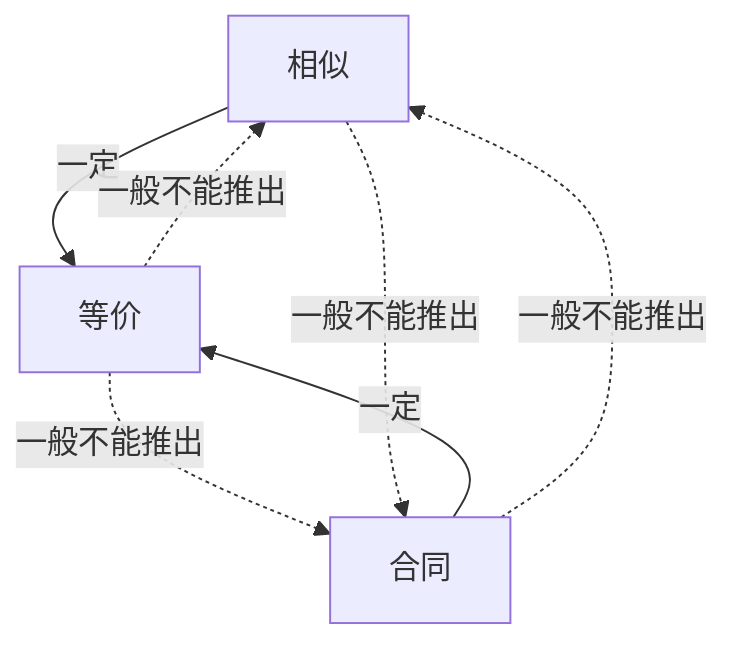

# 矩阵等价、相似、合同

## 定义

| 关系 | 定义 | 本质 | 研究对象 |
| :--- | :--- | :--- | :--- |
| 等价 | $B=PAQ$ | 行变换 + 列变换 | 矩阵 |
| 相似 | $B=P^{-1}AP$ | 同一线性变换在不同基下的表示 | 线性变换 |
| 合同 | $B=P^TAP$ | 同一二次型在不同基下的表示 | 二次型（实对称矩阵） |

其中 $P,Q$ 为可逆矩阵。

## 三者关系



## 判断方法

### 等价

定义：

$$
A\approx B
\iff
\exists P,Q,\ B=PAQ
$$

判据：

$$
A\approx B
\iff
r(A)=r(B)
$$

### 相似

定义：

$$
A\sim B
\iff
\exists P,\ B=P^{-1}AP
$$

必要条件：

- 行列式相同
- 迹相同
- 特征值相同

### 合同

定义：

$$
A\cong B
\iff
\exists P,\ B=P^TAP
$$

判据（实对称矩阵）：

- 正惯性指数相同
- 负惯性指数相同

## 传递性

- 等价具有传递性
- 相似具有传递性
- 合同具有传递性

## 保持的不变量

| 性质 | 等价 | 相似 | 合同 |
| :--- | :---: | :---: | :---: |
| 秩 | ✅ | ✅ | ✅ |
| 行列式 | ❌ | ✅ | ❌ |
| 迹 | ❌ | ✅ | ❌ |
| 特征值 | ❌ | ✅ | ❌ |
| 正、负惯性指数（实对称矩阵） | ❌ | ❌ | ✅ |

## 特殊情况下保持的性质

| 性质 | 等价 | 相似 | 合同 |
| :--- | :--- | :--- | :--- |
| 行列式 | 若 $\det(P)\det(Q)=1$ | ✅ | 若 $P$ 为正交矩阵 |
| 迹 | ❌ | ✅ | 若 $P$ 为正交矩阵 |
| 特征值 | ❌ | ✅ | 若 $P$ 为正交矩阵 |
| 正、负惯性指数 | ❌ | 实对称矩阵：✅ | ✅ |

## 合同变换公式

设

$$
B=P^TAP
$$

则

$$
\det(B)=\det(P)^2\det(A)
$$

$$
\operatorname{tr}(B)=\operatorname{tr}(APP^T)
$$

## 思维导图

```text
矩阵关系
│
├── 等价（PAQ）
│   ├── 保秩
│   ├── 判据：秩相同
│   └── 本质：行变换 + 列变换
│
├── 相似（P⁻¹AP）
│   ├── 保谱
│   │   ├── 特征值
│   │   ├── 行列式
│   │   └── 迹
│   ├── 判据：行列式、迹、特征值
│   ├── 本质：线性变换
│   └── ⇒ 等价
│
└── 合同（PᵀAP）
    ├── 保惯性
    │   ├── 正惯性指数
    │   └── 负惯性指数
    ├── 判据：惯性指数相同
    ├── 本质：二次型
    └── ⇒ 等价
```

## 记忆

> **等价保秩，相似保谱，合同保惯性。**
>
> **相似 ⇒ 等价；合同 ⇒ 等价；其余一般均不能互相推出。**