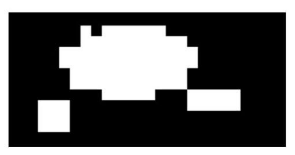
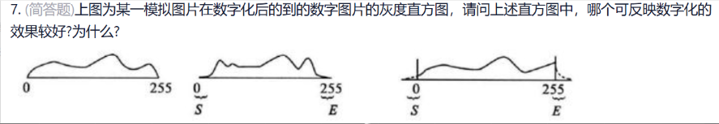
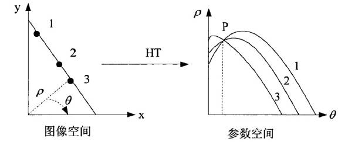

### 绪论

- 机器视觉是用**机器**代替人眼做**测量和判断** 
- 计算机视觉是将**图像信号转换成数字信号**，并利用计算机对其进行处理的技术
- 机器视觉工业应用的最大特点是**非接触式**观测技术，**高精度高速度** 
- 典型机器视觉系统
	- 图像采集单元
	- 图像处理单元
	- 通信控制单元
	- 终端监控单元
- 按操作方式分为
	- 可配置的视觉系统
	- 可编程的视觉系统
- 按性能分
	- 视觉传感器
	- 智能相机
	- 视觉处理器
- 机器视觉与计算机视觉的区别：机器视觉用机器代替人眼进行测量和判断，完成工业生产与民用领域的测量、引导、检测和识别任务，主要侧重“量”的分析，如通过视觉去测量零件的各种尺寸，又如检测产品是否有缺陷等，对准确度和处理速度要求都比较高。
- 计算机视觉利用计算机及其辅助设备来模拟人的视觉功能，实现对客观世界的三维场景进行感知、识别和理解，实现类似人的视觉功能，主要侧重“质”的分析，如分类识别，这是狗还是猫的问题;或身份确认，如人脸识别、车牌识别;或行为分析，如人员入侵、徘徊、人群聚集等判断。
- 机器视觉是用机器代替人眼进行测量和判断，完成工业生产和民用领域的测量、引导、检测和识别任务

### 相机

-  机器视觉在工业典型应用
	- 检测
	- 测量
	- 定位
	- 自动识别和规划
-  感光芯片
	- CCD
	- CMOS
-  面阵相机的**帧率和线阵相机的行频**表示图像采集的帧率
-  相机的触发模式：硬件 / 软件
-  相机接口
	- USB
	- 1394
	- 千兆网
	- CameraLink
-  相机芯片尺寸：1in、2/3in、1/2in，1/3in，1/4in
-  三维视觉传感器
	- 单目
	- 双目
	- 激光线扫
	- ToF
- 1970s MIT 开设课程 提出 **马尔视觉理论** 
- 物体的 2.5 维描述：是在观测者坐标系下对物体形状的粗略描述

### 镜头

- 镜头由多个  **镜片光圈** /**调焦装置** 
- 焦距： 主焦点到透镜光心的距离
- 焦距小 --> 视野广
- 光圈大 --> 景深小
- 焦距长 --> 景深小
- 典型畸变：枕形畸变 桶形畸变
- 接口
	- 螺口
		- 0.75（M42 M58 M72）
		- C口
		- CS口
	- 卡口
		- F口
- $\frac{f}{\text{物距}} = \frac{\text{CCD边}}{\text{视野边}}$

### 光源

- 发光材料
	- LED
	- 荧光灯
	- 卤素灯
- 三原色：红绿蓝
- 光源类型
	- 直射光
	- 漫射光
	- 偏振光
	- 平行光
- 彩色相机选白光
- 机器视觉需要用到的坐标系
	- 相机坐标系
	- 视觉坐标系
	- 图像坐标系
- 物体呈现颜色是因为反射光
- 日光包含所有颜色
- 如果入射光中没有和物体对应的颜色，则该物体没有光线反射出来
- 在一个纯蓝色光照明的屋子里，红色物体和黑色物体一样，看上去都是黑的
- 红光穿透性好，蓝光反射性好
- 如果检测对象和背景存在颜色差的话，合理选用光源颜色来得到最大的 **对比度**

### 数字图像处理

- 图像分类
	- 按亮度
		- 二值
		- 灰度
	- 按光谱
		- 彩色
		- 黑白
	- 按是否随时间变换
		- 静态
		- 动态
- 图像数字化过程
	- 采样间隔越大
		- 图像像素越少
		- 分辨率越低
		- 质量越差
	- 量化等级越多
		- 图像层次越丰富
		- 灰度分辨率越高
		- 质量越好
		- 数据量越大
- 
	- 四邻接 -- 3个连通区域
	- 八邻接 -- 2个连通区域
- 像素距离
	- 欧氏距离
	- 曼哈顿距离（城市街区距离）
	- 棋盘距离
- 灰度直方图只反映 **亮度分布**，不能反映 **颜色**
- 常见噪声
	- 高斯噪声
	- 泊松噪声
	- 乘性噪声
	- 椒盐噪声
- 
	- a恰当量化
	- b未能有效利用动态范围
	- c超过了动态范围
- 图像是连续的，用函数f(x,y)表示 **图像**，其中，x，y表示 **空间坐标点位置**，f 表示**图像在点(x，y)的某种性质的数值**，如 **亮度**、**灰度**、**色度** 
- 一幅图像对应唯一灰度直方图
- 不同图像可能对应同一灰度直方图
- 滤波
	- 中值滤波
		- 对 离散阶跃信号 有影响
		- 对 斜升信号        没有影响
	- 均值滤波
- 常见边缘
	- 直线型边缘
	- 阶梯型边缘
	- 斜坡型边缘
	- 折线型边缘
- 差分
	- 水平： $\Delta H = f(x, y+1) - f(x, y)$
	- 垂直：$\Delta H = f(x + 1, y) - f(x, y)$
	- 四邻域二阶差分 $4 \times \text{中间} - \text{上下左右}$
	$$
	\Delta H =  
	\begin{bmatrix}
	0 & -1 & 0 \\
	-1 & 4 & -1 \\
	0 & -1 & 0  
	\end{bmatrix}
	$$

### Hough变换
- Hough 变换是实现边缘检测的有效方法
- 可检测
	- 直线
	- 圆
	- 椭圆
	- 双曲线
	- 等
- 核心思想：将图像空间的直线检测问题---> 参数空间中的峰值检测问题
- 标准Hough变换中空间直线用极坐标表示为 $\rho = x \cos \theta + y \sin \theta$
- **点**在参数空间中对应--->正弦曲线
- $\rho$ 的取值由**图像对角线长度**决定
- $\theta \text{的取值范围一般为} [0, \pi)$
- 
	- P在参数空间中表示图像空间中同一条直线上的点（如 1、2、3 点）在参数空间所对应曲线的交点。这是因为图像空间的一条直线，其参数($\rho,\theta$)是固定的，该直线上所有点映射到参数空间的曲线都会经过$(\rho,\theta)$这个点（即 P 点代表了图像空间中这条直线的参数$(\rho$,$\theta)$ ）1、2、3在参数空间中分别表示图像空间中对应点（1、2、3 点）在参数空间所映射的曲线。图像空间中的每一个点(x,y)，在参数空间都对应一条曲线$\rho = x\cos\theta + y\sin\theta$ 
### 相机标定

$$
\begin{bmatrix}
u\\
v\\
1
\end{bmatrix}
 = K \left[ R | t \right ]
\begin{bmatrix}
X \\
Y \\
Z \\
1 
\end{bmatrix}
$$
$[u, v, 1]^T$：图像坐标系下的像素坐标
$K$：相机内参矩阵
$R$：旋转矩阵
$t$：平移向量
$[X, Y, Z, 1]^T$：世界坐标系下的三维点坐标

- 建立的坐标系
	- 世界坐标系
	- 相机坐标系
	- 图像坐标系
	- 像素坐标系
- 机器视觉中最基础的坐标系是 **像素坐标系**，原点位于 **图像的左上角** 
- 像素坐标系
	- 单位为 **mm**
	- 以**图像中心**为原点
	- 用于建立像素与物理尺寸的联系
- 相机坐标系
	- 原点在**相机光心**
	- Z 轴与 **相机光轴** 重合
	- 用于描述空间点在相机视角下的位置
- 相机外参矩阵
	- 描述**像素位置**与**场景点位置**的关系，包含旋转矩阵和平移向量
- 相机标定：指建立**图像点**与**空间点**的关系，即，求解相机模型的参数
- 相机内参矩阵
	- 包含 **焦距，像素点尺寸等** 相机固有参数
	- 该矩阵仅与相机自身硬件结构有关
- 小孔成像模型中，空间点的相机坐标通过 **透视投影变换** 可转换为图像坐标，该过程满足相似三角形原理

