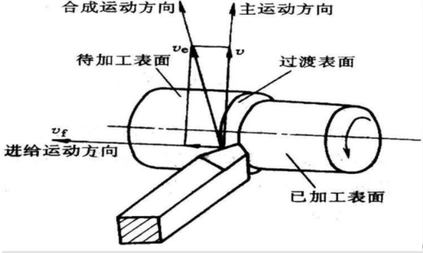
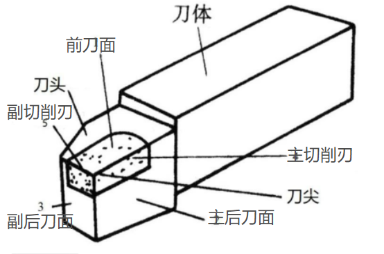

### 概要
1-2章需要掌握的内容
1. 什么是机械制造技术
	1. 机械制造技术是指机械制造领域生产实践中知识、经验、方法和操作技能及其制造装备的总和
2. 什么是机械制造的主要任务
	1. 围绕各种工程材料的加工技术研究其工艺，并设计和制造各种技术装备
3. 机械制造的意义
	1. 机械制造工业的发展直接影响和制约着工业、农业、交通、科研和国防各部门的生产技术和整体水平，进而影响着一个国家的综合生产实力
	2. 它是衡量一个国家经济实力和科学技术水平的重要标志
	3. 它是国民经济发展的基础、支柱和先导部门，早国民经济建设中起着重要作用
	4. 它是高技术产业化的载体和实现现代化的重要基石
4. 列出实现金属切削过程的三个必备条件
	1. 工件与刀具之间要有相对运动，即切削运动
	2. 刀具材料必须具备一定的切削性能
	3. 刀具必须具有适当的几何参数，即切削角度等
5. 为了获得零件的 **形状、尺寸精度和表面质量**，切削加工在机械加工中用用最为广泛
6. 什么是切削加工的主运动和进给运动
	1. 主运动：在切削加工时，直接切除工件上多余金属层，形成工件新表面的运动。每种切削方法只有一个主运动。
	2. 进给运动：不断将多余金属投入切削，以保证切削连续进行的运动。每种切削方法可以没有，也可以有一个或多个进给运动。
7. 什么是切削过程中的待加工表面、已加工表面和过渡表面
	1. 待加工表面：加工时即将被切除的工件表面
	2. 已加工表面：已被切除多余材料而形成符合要求的工件新表面
	3. 过渡表面（切削表面）：加工时由切削刃在工件上正在形成并随着切削不断消失的表面

8. 上图主运动方向为何向上？
	1. 切削过程中，各运动方向是规定工件不动，刀具相对工件的运动方向。在图示车削外圆时，工件转动，车刀向左向内进给，如果假定工件不动，则车刀围工件转动，在车刀和工件接触点处刀具相对工件的运动方向向上，故主运动方向向上。
9. 切削运动的三要素是：**切削速度** **进给量** **切削深度**
10. 进给量和进给速度有什么区别
	1. 进给量 $f$（feed）（走刀量）是指工件或刀具每转一转时，刀具相对于工件沿进给方向的位移，单位为 $mm/r$ 。对多刃切削刀具，规定每一个刀齿的进给量 $f_z$ ，单位为 $mm/z$ （毫米/齿）。
	2. 进给速度则是单位时间的进给量，单位为 $mm/s$ 或 $mm/min$ 。$v_f = f \cdot n$ 
11. 外圆车刀结构要素
 
12. 什么是主偏角、前角和后角
	1. 主偏角是指主切削刃在基面上的投影与假定进给方向之间的夹角。主偏角一般在 $0 \degree - 90 \degree$ 之间。
	2. 前角是指前刀面与基面之间的夹角。前刀面与基面平行时前角为零；刀尖位于前刀面最高点时，前角为正；刀尖位于前刀面最低点时，前角为负。
	3. 后角是指后刀面与切削平面之间的夹角。刀尖位于后刀面最前点时，后角为正；刀尖位于后刀面最后点时，后角为负。
13. 什么是切削层？什么是切削层参数？什么是切削厚度？什么是切削宽度？在车削中，切削厚度  $h_d$  与进给量 $f$ 、切削宽度 $b_D$ 与吃刀深度 $a_p$ 有什么关系？
14. 什么是金属切削过程？
	1. 金属切削过程是指刀具与工件相对运动相互作用，从工件上切除多余金属，从切削层变形形成切屑，到已加工表面形成为止的整个过程
15. 切削层参数包括：**切削厚度** **切削宽度** **切削面积** 
16. 什么是直角切削和斜角切削？
	1. 切削刃垂直于合成切削速度，为正或直角切削
	2. 否则为斜或斜角切削
17. 描述金属切削过程中的三个变形区各自的特点。
	1. 第 I 变形区：即剪切变形区，金属剪切滑移，成为切屑。金属切削过程的塑性变形主要集中于此区域。
	2. 第 II 变形区：靠近前刀面处，切屑排出时受前刀面挤压与摩擦。此变形区的变形时造成前刀面磨损和产生积屑瘤的主要原因。
	3. 第 III 变形区：已加工面受到后刀面挤压与摩擦，产生变形。此区变形是造成已加工面硬化和残余应力的主要原因。
18. * 为什么铸铁试样压缩时，破坏面常发生在与轴线大致成45度的方向
	1. 铸铁属脆性金属材料，由于其塑性变形很小，所以尽管有端面摩擦，鼓胀效应却并不明显。当做压缩试验时，应力达到一定值后，试样在与轴线大约成 $45\degree$ 的方向上发生破裂。这种现象是由于脆性材料的抗剪强度低于抗压强度，从而使试样被剪断。公式为：
	因为剪切应力
$$
	T = \frac{\delta}{2} \cdot \sin 2 \alpha 
$$
	$\delta$ 为许用应力 
	$\alpha$ 横截面外法线与斜截面外法线之间的夹角
	$\alpha = 45 \degree$ 时，$\sin 2 \alpha = 1$ 取得最大值，所以在铸铁试件压缩时与轴线大致成 45 度的斜截面具有最大的剪应力,故破坏断面与轴线大致成 45 度。
19. （不全）何为积屑瘤？特点？作用？和危害？
	1. 积屑瘤有增大刀具实际工作前角和保护刀刃的作用，但其不规则的形状和周期性的脱落，会引起已加工表面的粗糙变差，增大已加工表面粗糙度值。
20. 按工件材料的力学特性和切屑的形态，将切屑分为哪四种类型？
	1. 带状切屑
	2. 节状切屑
	3. 粒状切屑
	4. 崩碎切屑
21. 切屑形状及其流向主要与什么参数有关？
	1. 主要与刀具的刀面结构（如卷屑槽）和刀具角度（如刃倾角）等参数有关。
22. 节状切削产生的条件是什么
	1. 切削速度低
	2. 切削厚度大
	3. 前角较小
	4. 切削塑性金属材料
23. 切削铸铁、黄铜等 **脆性** 材料时，往往形成不了规则的细小的颗粒状切屑，称为 **崩碎切屑** 
24. 切削力的来源主要有哪两个方面？
	1. 一方面是切削层金属、切屑和工件表面层金属的弹性变形和塑性变形所产生的抗力；另一方面是刀具与切屑、刀具与工件表面之间的摩擦阻力。
25. 产生切削热的根本原因是什么？
	1. 切削过程中，三个变形区内的金属变形与摩擦是产生切削热的根本原因，切削过程中变形与摩擦所消耗的功，绝大部分转化为切削热。
26. 切削过程中产生的切削热，将通过 **切屑** **工件** **刀具和周围介质** 向切削区外传散
27. 当刀具磨损达到一定程度时，刀具便失去切削能力，出现 **切削力增大** **切削温度升高** **产生切削振动** 等不良现象
28. 什么是刀具磨损？什么是刀具破损？
	1. 切削过程中，刀面的材料微粒逐渐地被工件或切屑带走的现象称为刀具的正常磨损，简称刀具磨损。
	2. 由于冲击、振动、热效应等原因，致使刀具崩刃、卷刃、破裂、表层剥落而损坏的非正常情况称为刀具破损。
29. 防止刀具破损的措施有 **合理选择刀具材料** **选择合理的刀具角度** **选择适当的切削用量** 等
30. 金属切削条件的合理选择，主要是根据工件的材料及要求，**选择合适的刀具材料**、**刀具几何参数**、**切削用量** 和 **切削液**，以保证加工精度和表面质量，提高切削生产率，降低生产成本。
31. 刀具磨损的型式？用什么来衡量？
32. 刀具磨损过程可分几个阶段？其磨损情况有什么特点？刀具磨损的原因主要有哪几种？
33. 为什么材料的塑性越大，越难加工？
	1. 因为塑性大的材料加工变形和硬化、刀具表面的冷焊现象都比较严重，不易断屑，不易获得好的已加工表面质量。此外，切屑与前刀面的接触长度也将加大，使摩擦力增大。
34. 改善切削加工性的途径有哪些？
	1. 调整材料的化学成分，如在钢中适当添加一些元素，如硫钙铅等，使钢的切削加工性能得到显著改善。
	2. 通过热处理改变材料的组织和机械性能
35. 刀具材料必须具有高于工件材料的硬度，常温硬度须在 **HB62以上**，并要求保持较高的高温硬度 ==错误==
36. 耐磨性表示 **刀具抵抗磨损的能力**，它是刀具材料的 **机械性能**、**组织结构**、**化学性能** 的综合反映
37. 高速钢主要用来制造刃形复杂的刀具，如钻头、成形车刀、拉刀、齿轮刀具等 ==正确==
38. 陶瓷是由高硬度、难熔的金属碳化物（WC、TiC、TaC、NbC和TiN）粉末，用钻或镍等金属作粘结剂，经烧结而成的 ==错误  硬质合金是由……==
39. 在切削过程中，切削液具有什么作用
	1. 冷却、清洗、润滑、防锈
40. 切削用量中对刀具耐用性影响最大的是哪一个？最小的是哪一个？根据这一规律，在选取切削用量时，应按什么次序确定？
	1. 从影响刀具的寿命来看，影响最小的是切削深度 $a_p$，其次是进给量 $f$，影响最大的是切削速度 $v_c$
	2. 在保证一定刀具耐用度的前提下，首先选择较大的切削深度 $a_p$，其次按工艺装备与零件加工的技术要求选择较大的进给量 $f$，最后再根据刀具耐用度确定切削速度 $v_c$
41. 什么是工件材料的切削加工性？衡量材料切削加工性的指标有哪些？
	1. 工程材料的切削加工性是指弓箭裁量被切削加工成合格零件的难易程度。
	2. 衡量材料加工性的指标有：
		1. 刀具耐用度（寿命）$T$ 或一定寿命下的切削速度 $v_T$
		2. 材料的相对切削加工性 $K_r$
		3. 以切削力或切削温度衡量切削加工性
		4. 以已加工表面质量衡量切削加工性
		5. 以切屑控制或断屑的难易程度衡量切削加工性
42. 孔加工工具分为哪几类？
	1. 通常分为：钻头（中心钻、麻花钻、扁钻、深孔钻）、扩孔钻、锪孔钻、铰刀、镗刀和复合刀具等
43. 螺纹加工刀具有哪两类型？各列出一些刀具名称。
	1. 用切削法加工的：螺纹车刀、螺纹梳刀、板牙、丝锥、螺纹铣刀、自动开合螺纹切头
	2. 用滚压法加工的：滚丝轮、搓丝板
44. 磨削过程经历哪三个阶段？各阶段的特点是什么？
	1. 磨削过程经历了滑擦、耕犁、切屑形成三个阶段
		1. 第一阶段称为滑擦阶段。磨粒与工件表面发生接触，磨粒挤压工件表面，接触区内产生弹性变形，随着磨粒与工件表面相对运动，弹性变形逐渐增大，产生的摩擦力也随之增大，磨粒与工件表面产生相对滑移和摩擦，简称滑擦
		2. 第二阶段称为耕犁阶段。随着滑擦加剧，产生大量的热，工件表面层金属的温度升高，材料的屈服应力下降，磨粒的切削刃就被压人材料塑性基体中，由于磨粒与工件的相对运动，磨粒把塑性变形的金属推向磨粒的前方和侧面，致使工件表面产生隆起现象，形成犁沟或刻划出痕迹
		3. 第三阶段称为切屑形成阶段。在上述两个阶段中，没有切屑产生。随着耕犁阶段使磨粒的切削刃前面的隆起增大，其磨削厚度增大，但磨削厚度达到某一临界值时，磨粒对工件切削层材料产生挤压剪切，将材料层切除，并沿削刃的前面滑出，从而形成切屑
45. 什么是传动链？
46. 切削用量选取的顺序？
47. CA6140车床摩擦片离合器超越离合器安全离合器的作用分别是什么
48. 机床按精度等级如何划分？
49. 何为机床传动系统图？机床的传动原理图？机床的转速图？有何区别？
50. 什么是外联系尺寸链？
51. 刀具材料应该具备那些性能？常用刀具材料的种类有哪些？它们有哪些特点？
52. 滚齿加工齿轮用到哪几种尺寸链？
53. 什么是单位切削力？
54. 选择刀具材料时，应注重刀具材料的哪些性能？
55. 何为深孔加工？深孔加工中存在哪些困难？
56. 什么是工件表面的冷作硬化？
57. 加工表面成形的四种方法？何为发生线？
58. 车刀有那些类型？其工艺范围？
59. 铣刀有那些类型？其工艺范围？
60. 齿轮刀具有那些类型？
61. 拉刀有那些类型？拉刀有哪几部分组成？
62. 螺纹刀具有那些类型？
63. 何为运动平衡式？可以根据传动系统图或转速图列出运动平衡式。
#### 数控部分
1. 提高机床刚度的方法有那些？
2. 提高机床热稳定性的措施有那些？
3. 数控机床主轴传动有那些方式？
4. 滚珠丝杠调整间隙的方式有哪些？
5. 齿差式间隙调整量如何计算？
6. 导轨的作用？
7. 滑动导轨的截面形式有那些？
8. 数控刀架的基本构成有哪几部分组成？
9. 数控机床刀库刀具的识别方式有些？
#### 第三章
1. 什么是机械加工工艺过程？什么是工艺规程？工艺规程在生产中有何作用？
2. 什么是工序、安装、工位、工步和走刀？
3. 什么是生产类型？什么是生产纲领？两者有何区别？
4. 常用的零件毛坯有哪些形式？各类毛坯适用场合？
5. 什么是粗基准？什么是精基准？选择粗、精基准应遵循什么原则？何为基准重合原则？ 何为基准统一原则？什么是互为基准？什么是自为基准？
6. 什么是加工经济精度？选择表面加工方法应考虑哪些问题？
7. 制订工艺规程时，为什么要划分加工阶段？加工阶段划分为哪几种？什么情况下可以不划分或不严格划分加工阶段？
8. 试简述按工序集中原则、工序分散原则组织工艺过程的工艺特征，各用于什么场合？
9. 工序顺序安排应遵循哪些原则？如何安排热处理工序？
10. 何谓时间定额？它在生产中有何作用？什么是单件时间定额？如何计算？
#### 第四章
1. 按夹具的适用对象和使用特点夹具可分为何种夹具？
2. 机床夹具上常用的夹紧机构有哪些？
3. 名词解释： ① 机床夹具； ② 自由度； ③ 定位； ④ 夹紧； ⑤ 完全定位； ⑥ 不完全定位;⑦过定位（重复定位）；⑧欠定位;⑨六点定位原理;⑩定位误差。
4. 完全定位、不完全定位和过定位情况分别应用在什么场合？
5. 选择夹紧力方向时一般遵循什么原则？
6. 机床夹具一般有哪几部分组成？各自作用是什么？
#### 第五章
1. 机械加工精度包括哪几方面？
2. 何为加工精度？
3. 何为加工误差？
4. 机械加工工艺系统包括什么？
5. 工艺系统的原始误差分哪几类？ 影响机床精度的原始误差有哪些？
6. 机床制造误差中对工件加工影响较大的三类误差是什么？
7. 何为原理误差？
8. 何为调整误差？
9. 何为测量误差？
10. 误差敏感方向？
11. 何为加工经济精度？
12. 加工表面的微观几何形状误差包括什么？
13. 表面层金属性能方面的质量包括什么？
14. 误差分布出现平顶分布、双峰分布、偏态分布的主要原因是什么？
15. 何为表层加工硬化？
16. 什么是误差复映，其有何规律？
17. 加工误差分为哪几类？何为系统性误差？何为随机性误差。
#### 第六章
1. 保证装配精度的四种方法包括什么？ 各自适用什么场合？各有何优缺点？
2. 什么是装配单元？