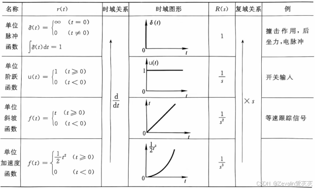

### 1. 绪论

### 2. 系统的数学模型
#### 系统的微分方程
- 高阶微/积分的拉普拉斯变换
$$
\begin{aligned}
\mathcal{L} \left[ \frac{d^nx(t)}{dt^n} \right] = X(s)S^n  \\
\mathcal{L} \left[ \int \overset{n}{\cdots} \int x(t)(dt)^n \right] = \frac{X(s)}{S^n} 
\end{aligned}
$$
#### 系统的传递函数
- 特点
    - 传递函数是关于复变量 s 的复变函数，为 **复域数学模型**
    - 分母反映系统本身的固有特性，与外界无关；分子反映系统与外界的联系
    - 在零初始条件下，输入确定时，输出完全取决于传递函数 $\mathrm{x_{o}}(t) = \mathcal{L}^{-1} [X_{o}(s)] = \mathcal{L}^{-1}[G(s)X_{i}(s)]$ 
    - 物理性质不同的系统，可以具有相同的传递函数（相似系统）

$$
G(s) = \frac{X_{o}(s)}{X_{i}(s)} = \frac{b_{m}s^m + b_{m-1}s^{m-1} + \cdots + b_{1}s + b_{0}}{a_{n}s^n + a_{n-1}s^{n-1} + \cdots + a_{1}s + a_{0}}, \quad n \geq m
$$
- 系统稳定的 **充要条件** ：极点有负实部
    - 分子 **零点** ；分母 **极点** $\rightarrow$ **零极点模型**
- 典型环节
    $$
    G(s) = \frac{\displaystyle{K\prod_{i = 1}^b( \tau_{i}s+1) \prod_{l = 1}^c (\tau _{l}^2s^2 + 2 \xi_{l}\tau_{l}s + 1)}}{\displaystyle s^v\prod_{j = 1}^d(T_js+1)\prod_{k = 1}^e (T _{k}^2s^2 + 2 \xi_{k}T_{k}s + 1)} 
    $$ 
    $$
    G(s) = 
    \frac{
      \displaystyle
      \overbrace{K}^{\text{比例}}
      \overbrace{\prod_{i = 1}^b (\tau_{i}s + 1)}^{\text{一阶微分环节}}
      \overbrace{\prod_{l = 1}^c (\tau_{l}^2 s^2 + 2 \xi_{l}\tau_{l}s + 1)}^{\text{二阶振荡（微分型）}}
    }{
      \displaystyle
      \underbrace{s^v}_{\text{积分环节（$v$ 阶）}}
      \underbrace{\prod_{j = 1}^d (T_j s + 1)}_{\text{惯性环节}}
      \underbrace{\prod_{k = 1}^e (T_{k}^2 s^2 + 2 \xi_{k} T_{k} s + 1)}_{\text{二阶振荡（惯性型）}}
    }
    $$
    - 比例环节
        - $G(s) = \frac{X_o(s)}{X_i(s)} = K$
    - 惯性环节
        - $G(s) = \frac{1}{Ts + 1}$
        - 惯性环节一般包含一个储能元件和一个耗能元件
    - 微分环节
        - $G(s) = \frac{X_o(s)}{X_{i}(s)} = Ts$
        - **微分环节不可能单独存在**
    - 积分环节
        -  $G(s) = \frac{X_o(s)}{X_{i}(s)} = \frac{1}{Ts}$
    - 振荡环节（二阶振荡环节）  #复习/重点 
        - $G(s) = \frac{\omega _{n}^2}{s^2+2\xi \omega _{n}s + \omega _{n}^2}$ 或写成 $G(s) = \frac{1}{T ^{2}s ^{2} + 2 \xi Ts + 1}$ 
        - $\omega _{n}$ 为无阻尼固有频率；$T$ 为振荡环节的时间常数，$T = \frac{1}{\omega _{n}}$；$\xi$ 为阻尼比，$0 \leq \xi \lt 1$ .  
#### 方框图及其简化
   - 串联
        - $G(s) = G_{1}(s) G_{2}(s)$ 
    - 并联
        - $G_{s} = G_{1}(s) \pm G_{2}(s)$ 
    - 开环传递函数
        - $G_{K} = \frac{B(s)}{E(s)} = G(s)H(s)$ 
        - **开环传递函数无量纲** 
    - 闭环传递函数
        - $G_{B}(s) = \frac{X_{o}(s)}{X_{i}(s)} = \frac{\prod \text{前向通路传递函数}}{1+ \sum{\text{每一反馈回路开环传递函数}}}$ %% 例 ：P57%%
 
### 3. 时域响应分析
#### 典型输入信号 %% 教材P86 %%
- 单位脉冲信号(功率密度信号)
- 单位阶跃信号(位置信号)
- 单位斜坡信号(速度信号)
- 单位加速度信号
- 正/余弦信号
- 随机信号
 
    图中 $R_{s}$ 即 $X_i(s)$ 
### 4. 频域响应分析
### 5. 系统稳定性分析
### 6. 性能指标