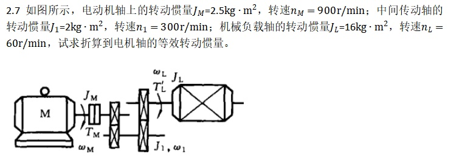

### 转动惯量折算

$$
\begin{aligned}
j_1 &= \frac{\omega_{M}}{\omega_1} = \frac{n_M}{n_1} = 3 \\
j_L &= \frac{\omega_M}{\omega_L} = \frac{n_M}{n_L} = 15 \\
J_Z &= J_M + \frac{J_1}{i_1^2}+ \frac{J_L}{i_L^2} \\
&= 2.5 + 2 /9 + 16/225 \\
&= 2.79 kg\cdot m^2

\end{aligned}
$$
$$
x/y
$$
